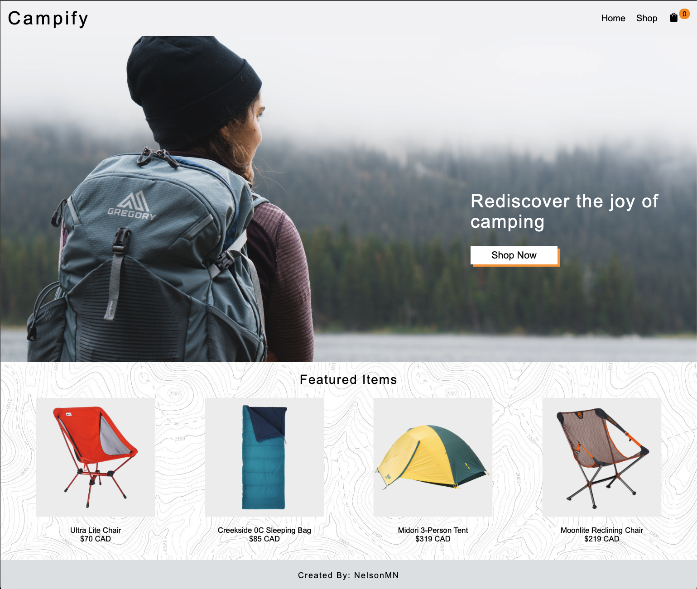
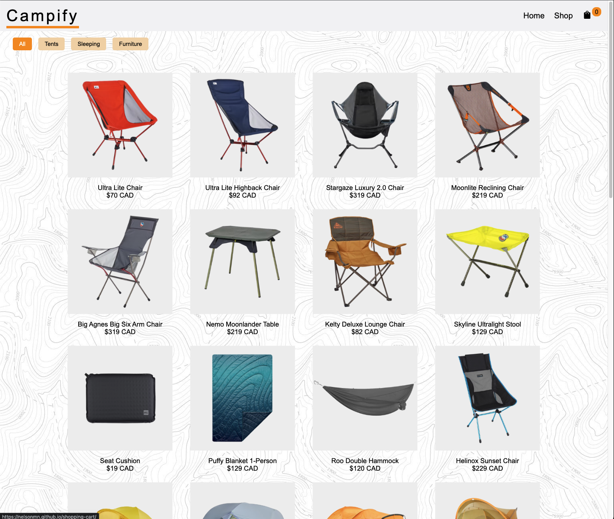
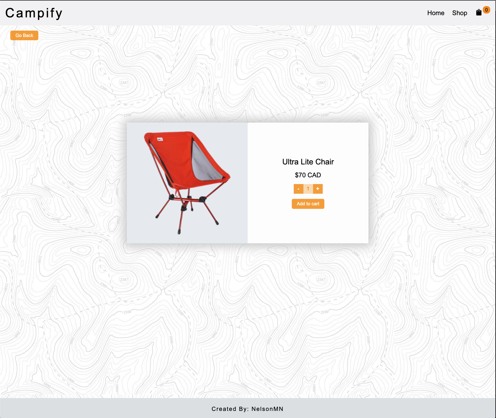
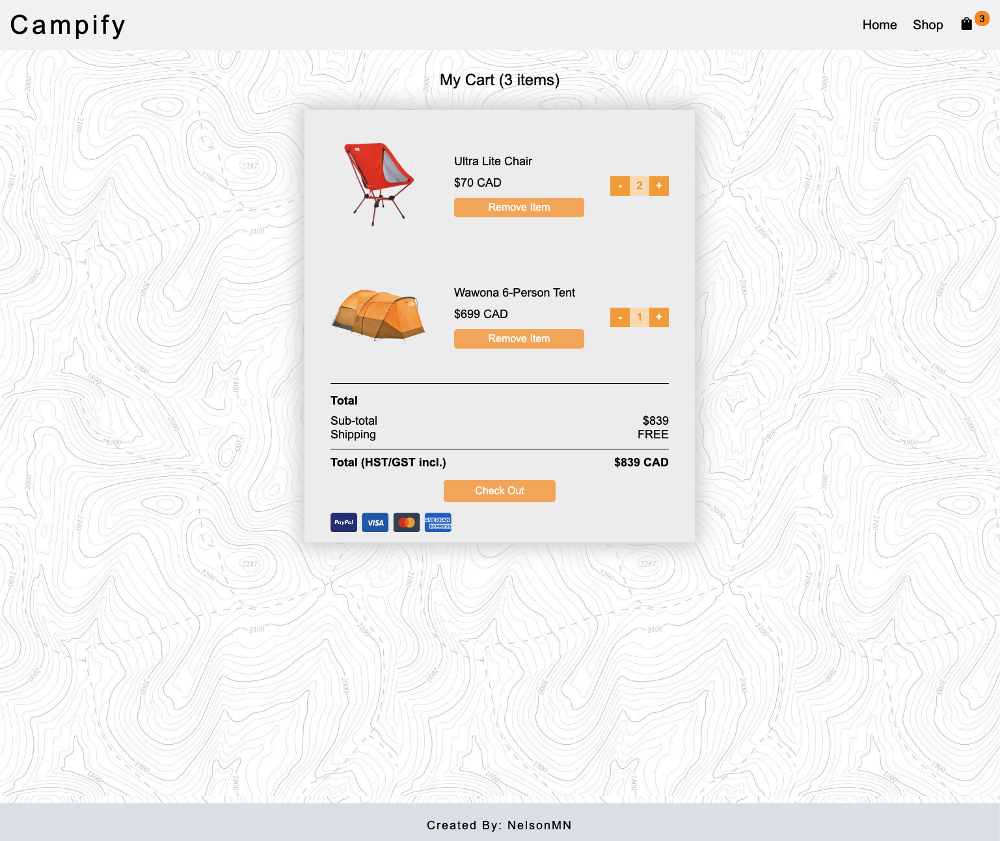
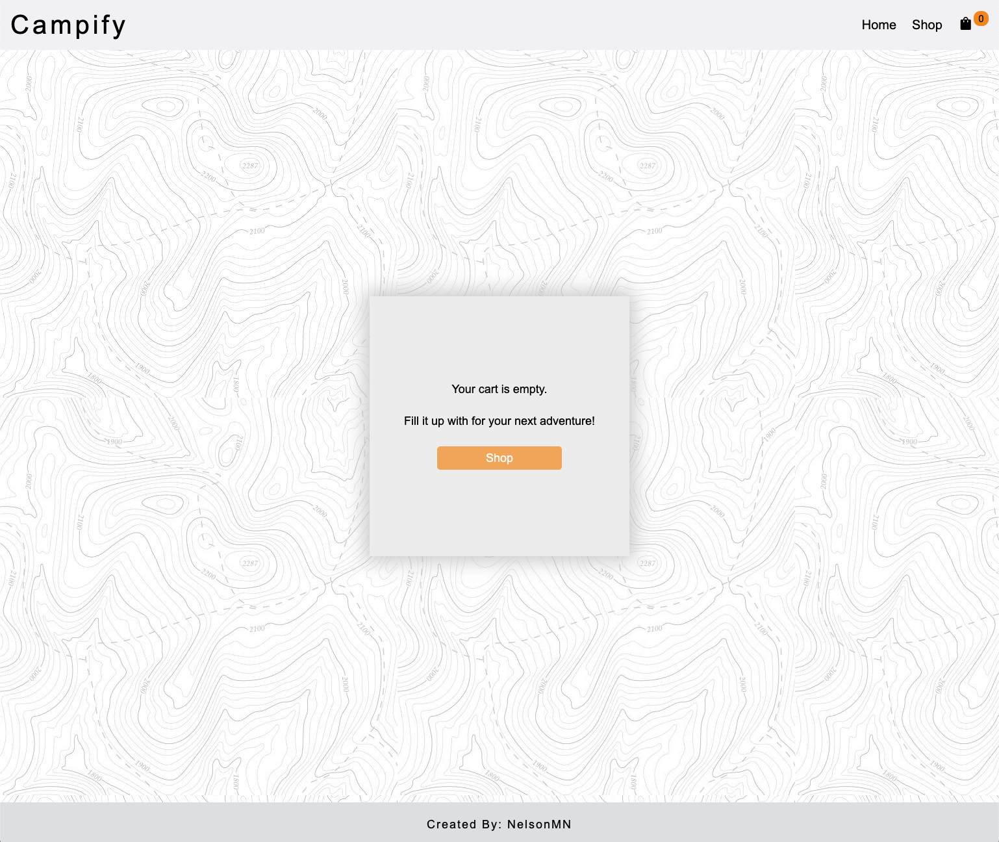

## Campify

This is a mock online store allowing users to shop camping related items built with ReactJS. It uses functional components, hooks, and React Router DOM for seamless navigation between pages.

## Screenshots

     

     

     

     

     

### Built With

* [React.js](https://reactjs.org/)
* [Create React App](https://create-react-app.dev/)
* [JavaScript](https://www.javascript.com/)
* [React Router](https://reactrouter.com/)

## Contact

Nelson M - https://www.linkedin.com/in/nelsonmieszkalski/

Project Link: [https://nelsonmn.github.io/shopping-cart/] (https://nelsonmn.github.io/shopping-cart/)
